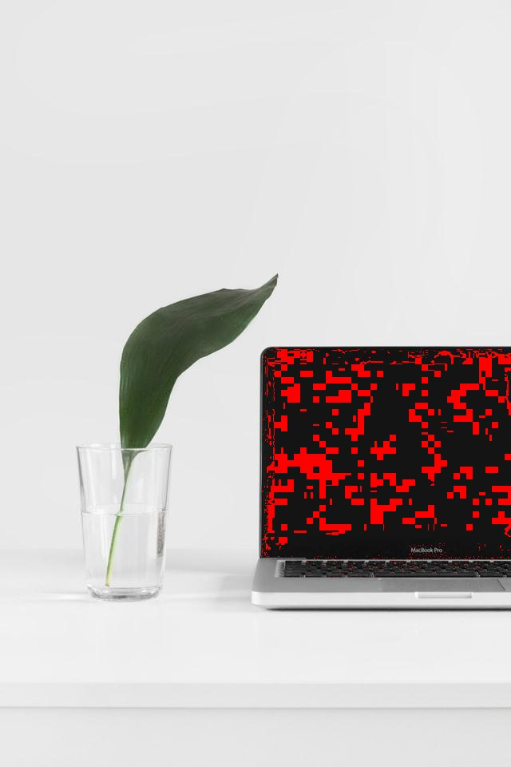

# specific_colors_swapping

    
    

  - Required library : PIL

  - Image Reference: "https://unsplash.com/photos/QeVmJxZOv3k?utm_source=unsplash&utm_medium=referral&utm_content=creditShareLink"
